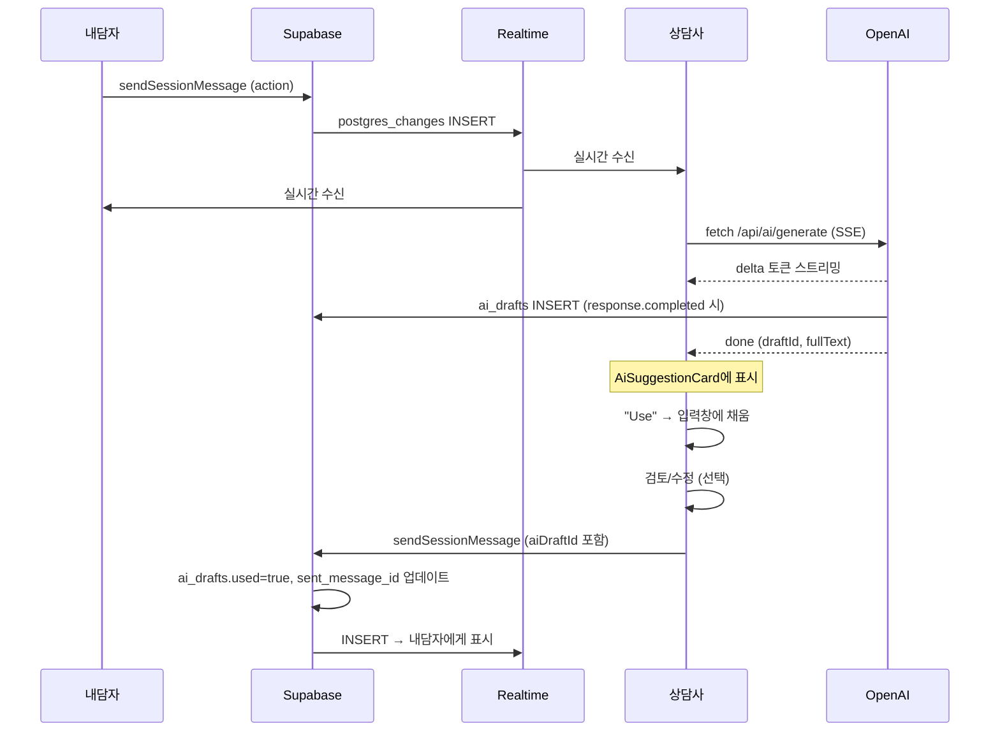

# AI 코파일럿 구현 계획

> **선행 조건**:
> 1. [`chat_db_setup_plan.md`](./chat_db_setup_plan.md) 전부 완료
> 2. [`chat_app_plan.md`](./chat_app_plan.md) 전부 완료 (`chat-session-page.tsx`가 동작해야 AI가 이를 참조)

AI 코파일럿은 `session_messages`/`session_rooms`를 기반으로 동작하며, 모든 AI 초안을 **fine-tuning 데이터셋용으로 DB에 기록**합니다.

## 사전 준비 (유저 수동 작업)

1. **`.env`에 OpenAI API 키 추가**
   ```
   OPENAI_API_KEY=sk-...
   ```
2. **`.env.sample`에도 추가** (버전관리용)
   ```
   OPENAI_API_KEY="your_openai_api_key"
   ```

## 확정된 결정 사항

| 항목                   | 결정                                                                              |
| ---------------------- | --------------------------------------------------------------------------------- |
| useFetcher + SSE       | **불가** — useFetcher는 request-response용. `fetch` + `ReadableStream` 사용       |
| "Use" 버튼             | **(a)** 메시지 입력창에 채움 → facilitator가 검토/수정 후 직접 전송               |
| conversation 단위      | **`session_rooms` 1:1**. end→start 재활성화해도 같은 conversation 유지            |
| conversation 메시지 수 | **최근 50개**. 50개 도달 시 shadcn Alert로 새 세션 권장 (soft warning, 차단 X)    |
| Generate AI 트리거     | **(b)** messageId 불필요, 전체 맥락 기반. 입력창 옆 "AI 초안" 버튼 하나           |
| 연속 AI 요청           | **차단** — 생성 중이면 shadcn Alert로 안내                                        |
| AI 에러 UX             | 카드에 에러 메시지 + "다시 시도" 버튼 (MVP)                                       |
| AI 호출 권한           | facilitator만 (session_rooms.facilitator_id === auth.uid())                       |
| AI 호출 가능 시점      | 세션 active 여부와 무관 (start/end는 시간 측정용일 뿐)                            |
| openai 패키지          | 이미 설치됨 (`^6.36.0`)                                                           |
| 모델                   | `gpt-5.4-nano` (CLAUDE.md OpenAI 사용 섹션 기준)                                  |
| Draft 저장 (refine 포함) | `ai_drafts` 테이블, `parent_draft_id` self-FK로 refine 체인 표현                 |

---

## 작업 순서 요약

| Step | 담당  | 작업                                              |
| ---- | ----- | ------------------------------------------------- |
| 1    | 유저    | `.env` / `.env.sample` 에 OPENAI_API_KEY 추가     |
| 2    | 에이전트 | `features/facilitators/ai/schema.ts` (ai_drafts) |
| 3    | 유저    | `npm run db:generate` → `npm run db:migrate`     |
| 4    | 유저    | Supabase 대시보드에서 ai_drafts RLS SQL 실행      |
| 5    | 유저    | `gen types` 재실행                                |
| 6    | 에이전트 | `app/lib/openai.server.ts` 작성                  |
| 7    | 에이전트 | Resource Route `/api/ai/generate` 작성           |
| 8    | 에이전트 | `chat-session-page.tsx` AI 통합 (UI + 스트리밍)   |
| 9    | 에이전트 | `sendSessionMessage` mutation 확장 (`aiDraftId` 파라미터 처리) |

---

## Step 2. `features/facilitators/ai/schema.ts` (신규)

위치: `app/features/facilitators/ai/schema.ts`

```ts
import {
  pgTable,
  uuid,
  text,
  boolean,
  timestamp,
  type AnyPgColumn,
} from 'drizzle-orm/pg-core';
import { profiles } from '~/features/all-users/users/schema';
import {
  sessionRooms,
  sessionMessages,
} from '~/features/all-users/chats/schema';

export const aiDrafts = pgTable('ai_drafts', {
  draft_id: uuid().primaryKey().defaultRandom(),
  session_id: uuid()
    .notNull()
    .references(() => sessionRooms.session_id, { onDelete: 'cascade' }),
  facilitator_id: uuid()
    .notNull()
    .references(() => profiles.profile_id, { onDelete: 'cascade' }),
  // refine 체인: 원본은 NULL, refine한 결과는 이전 draft_id를 가리킴
  parent_draft_id: uuid().references(
    (): AnyPgColumn => aiDrafts.draft_id,
    { onDelete: 'set null' }
  ),
  refine_instruction: text(),    // refine 호출 시 facilitator의 지시 (없으면 NULL = 원본 생성)
  content: text().notNull(),     // AI가 생성한 원문
  used: boolean().notNull().default(false),  // "Use" 버튼 클릭 여부
  sent_message_id: uuid().references(
    () => sessionMessages.message_id,
    { onDelete: 'set null' }
  ),                              // 최종 전송된 session_message FK (NULL이면 미전송)
  created_at: timestamp().notNull().defaultNow(),
});
```

### refine 체인 모델

```
[원본 draft]            parent_draft_id=NULL, refine_instruction=NULL
  ├─ [refine 1]         parent_draft_id=원본, refine_instruction="더 공감적으로"
  │   └─ [refine 2]     parent_draft_id=refine1, refine_instruction="더 짧게"
  └─ [재생성 원본]      parent_draft_id=NULL (regenerate = 새 트리 시작)
```

같은 trigger 발화 안에서 facilitator가 어떤 경로를 거쳤는지 (어떤 초안을 reject하고 어떻게 refine했는지) 그대로 보존됩니다. fine-tuning 시 root까지 거슬러 올라가는 재귀 CTE로 chain 재구성 가능.

---

## Step 3. 마이그레이션 (유저 수동)

```bash
npm run db:generate
npm run db:migrate
```

---

## Step 4. `ai_drafts` RLS 정책 (유저가 SQL 에디터에서 실행)

> **결정적으로 중요**: `ai_drafts`는 client가 절대 SELECT 못 해야 합니다. AI 초안 원문이 client에게 노출되면 안 됩니다.

```sql
ALTER TABLE public.ai_drafts ENABLE ROW LEVEL SECURITY;

CREATE POLICY "facilitators view their own ai drafts"
  ON public.ai_drafts FOR SELECT
  USING (facilitator_id = auth.uid());

CREATE POLICY "facilitators create ai drafts for their sessions"
  ON public.ai_drafts FOR INSERT
  WITH CHECK (
    facilitator_id = auth.uid()
    AND EXISTS (
      SELECT 1 FROM public.session_rooms
      WHERE session_id = ai_drafts.session_id
      AND facilitator_id = auth.uid()
    )
  );

CREATE POLICY "facilitators update their own ai drafts"
  ON public.ai_drafts FOR UPDATE
  USING (facilitator_id = auth.uid());
```

> `client_id`로는 어떤 SELECT 정책도 부여하지 않으므로, client는 row의 존재 자체를 알 수 없습니다.

---

## Step 5. 타입 재생성 (유저 수동)

```bash
npx supabase gen types typescript --project-id <PROJECT_ID> > database.types.ts
```

---

## Step 6. `app/lib/openai.server.ts` (신규)

```ts
import OpenAI from 'openai';

export const openai = new OpenAI({ apiKey: process.env.OPENAI_API_KEY! });

export const THE_WORK_INSTRUCTIONS = `
당신은 "The Work" (Byron Katie의 네 가지 질문) 철학에 기반한 텔레테라피 플랫폼의
facilitator(상담사)를 보조하는 AI 코파일럿입니다.

상담사가 내담자에게 보낼 답변 초안을 작성합니다.

핵심 원칙:
1. 네 가지 질문 — "그것이 진실인가?" / "정말 그것이 진실임을 확실히 알 수 있는가?"
   / "그 생각을 믿을 때 어떻게 반응하는가?" / "그 생각이 없다면 누구일까?"
2. 진단하지 않습니다. 판단하지 않습니다. 답을 제시하지 않습니다.
3. 내담자가 스스로 통찰을 찾을 수 있도록 질문합니다.
4. 내담자의 마지막 발화와 같은 언어로 응답합니다.
5. 길이는 1~3문장으로 간결하게.
6. 최종 결정은 항상 인간 상담사가 합니다. 당신은 초안만 제공합니다.
`;
```

- `.server.ts` 확장자 → Vite/RR가 클라이언트 번들에서 자동 제외

---

## Step 7. Resource Route `/api/ai/generate`

`routes.ts`에 등록:
```ts
route("/api/ai/generate", "features/facilitators/ai/api/generate.ts")
```

### action 흐름

```
POST /api/ai/generate
Body: { sessionId, refineInstruction?, parentDraftId? }

1. makeSSRClient → getLoggedInUserId
2. session_rooms 조회 → facilitator_id === userId 검증 (RLS가 막아주지만 명시적 체크)
3. conversation ID 확보:
   a. session_rooms.openai_conversation_id 조회
   b. 없으면:
      - 최근 50개 session_messages 조회 (chronological)
      - openai.conversations.create({ items: messagesToItems(messages) })
      - 반환된 id를 session_rooms.openai_conversation_id 에 UPDATE
4. openai.responses.create({
     model: 'gpt-5.4-nano',
     instructions: THE_WORK_INSTRUCTIONS,
     input: buildInput(latestClientMessage, refineInstruction),
     conversation: convId,    // 문자열 ID
     stream: true,
     store: true,
   })
5. ReadableStream으로 SSE 중계:
   - response.output_text.delta → event: delta, data: { token }
   - 누적된 fullText를 메모리에 보관
   - response.completed →
     a. ai_drafts INSERT {
          session_id, facilitator_id: userId,
          parent_draft_id: parentDraftId ?? null,
          refine_instruction: refineInstruction ?? null,
          content: fullText,
        } → 반환된 draft_id 획득
     b. event: done, data: { draftId, content: fullText } 전송
     c. stream close
```

### input 구성

**중요**: conversation ID가 살아 있는 동안은 OpenAI가 이전 메시지를 자동 관리합니다. **새 턴만** input에 담아 보냅니다.

```ts
function buildInput(latestMessage: Message, refineInstruction?: string): string {
  if (refineInstruction) {
    return `[상담사 지시] ${refineInstruction}`;
  }
  return latestMessage.content;
}

// 최초 conversation 생성 시 과거 메시지를 items로 변환
function messagesToItems(messages: Message[]) {
  return messages.map((msg) => ({
    type: 'message' as const,
    role: msg.sender_type === 'client' ? 'user' : 'assistant',
    content: msg.content,
  }));
}
```

> 50개 제한은 **최초 conversation 생성 시점**에만 의미가 있습니다. 이후엔 OpenAI conversation state가 누적 관리합니다.

---

## Step 8. `chat-session-page.tsx` AI 통합 (B3)

> 채팅 기본 기능 (loader/action/Realtime/likes)은 `chat_app_plan.md` B3에서 이미 구현된 상태를 전제로 합니다. 여기선 **AI 통합 레이어만** 추가합니다.

### state

```ts
const [aiSuggestion, setAiSuggestion] = useState('');
const [currentDraftId, setCurrentDraftId] = useState<string | null>(null);
const [isGenerating, setIsGenerating] = useState(false);
const [aiError, setAiError] = useState<string | null>(null);
const abortRef = useRef<AbortController | null>(null);
const [messageInput, setMessageInput] = useState(''); // 메시지 입력창 controlled value
```

### Generate AI

```ts
const handleGenerateAi = async (refineInstruction?: string) => {
  if (isGenerating) {
    // shadcn Alert: "AI가 응답을 생성 중입니다. 완료 후 다시 시도해주세요."
    return;
  }
  setIsGenerating(true);
  setAiSuggestion('');
  setAiError(null);
  const abort = new AbortController();
  abortRef.current = abort;

  try {
    const res = await fetch('/api/ai/generate', {
      method: 'POST',
      headers: { 'Content-Type': 'application/json' },
      body: JSON.stringify({
        sessionId,
        refineInstruction,
        parentDraftId: refineInstruction ? currentDraftId : null,
      }),
      signal: abort.signal,
    });
    // ReadableStream 파싱:
    //  - delta 이벤트 → setAiSuggestion(prev => prev + token)
    //  - done 이벤트 → setCurrentDraftId(draftId)
  } catch (err) {
    if (err.name !== 'AbortError') setAiError('AI 응답 생성에 실패했습니다.');
  } finally {
    setIsGenerating(false);
  }
};
```

### Use 버튼 / 전송 시 draft 연결

```ts
const handleUse = () => {
  setMessageInput(aiSuggestion);  // 입력창에 채움 — 자동 전송 X
};

// 메시지 전송 시 currentDraftId 함께 보내기
const handleSend = () => {
  const formData = new FormData();
  formData.set('intent', 'message');
  formData.set('content', messageInput);
  if (currentDraftId && messageInput === aiSuggestion) {
    // 입력창 내용이 AI 초안과 정확히 같으면 → "원본 그대로 사용"
    formData.set('aiDraftId', currentDraftId);
  } else if (currentDraftId) {
    // facilitator가 수정한 경우 → 여전히 같은 draft 기반이지만 수정됨
    formData.set('aiDraftId', currentDraftId);
  }
  submit(formData, { method: 'post' });
  setMessageInput('');
  setAiSuggestion('');
  setCurrentDraftId(null);
};
```

### `sendSessionMessage` mutation 확장

`chat_app_plan.md`에서 이미 정의한 함수를 **`aiDraftId` 선택 파라미터**를 받도록 확장:

```ts
sendSessionMessage(client, {
  sessionId, senderId, senderType, content,
  aiDraftId?, // ← 추가
});
```

동작:
1. `session_messages` INSERT → 새 `message_id`
2. `aiDraftId` 있으면:
   ```sql
   UPDATE ai_drafts
   SET used = true, sent_message_id = $newMessageId
   WHERE draft_id = $aiDraftId
     AND facilitator_id = $senderId
   ```
   (RLS가 자동으로 본인 것만 업데이트 가능하게 막아줌)

### UI 변경

- 메시지마다 "Generate AI" 버튼 ❌ → 입력창 영역에 **"AI 초안" 버튼 하나**
- `AiSuggestionCard`: 기존 props 그대로 사용
  - `onUse` → `handleUse()`
  - `onRegenerate` → `handleGenerateAi()` (refineInstruction 없이 — 새 트리)
  - `onRefine(text)` → `handleGenerateAi(text)` (parentDraftId 자동 연결)
  - `onStop` → `abortRef.current?.abort()`
- 에러 시: 카드에 에러 메시지 + "다시 시도" 버튼 (`onRegenerate` 호출)
- **50개 soft warning**: `messages.length >= 50`이면 shadcn Alert로 "이 세션이 길어졌습니다. 새 세션 시작을 권장합니다." 표시. 차단은 안 하고 계속 진행 가능.

---

## fine-tuning 데이터셋 추출 (참고)

나중에 데이터셋을 export할 때 사용할 쿼리 예시:

```sql
-- 채택된 draft (실제 전송된 것들)
SELECT
  d.draft_id,
  d.session_id,
  d.parent_draft_id,
  d.refine_instruction,
  d.content       AS ai_draft,
  m.content       AS final_sent_content,
  d.created_at
FROM ai_drafts d
INNER JOIN session_messages m ON m.message_id = d.sent_message_id
WHERE d.used = true
ORDER BY d.created_at;

-- reject된 draft (다른 draft를 골랐거나 직접 작성)
SELECT * FROM ai_drafts WHERE used = false;
```

- `(content, refine_instruction, parent_draft_id)` → 어떤 컨텍스트에서 어떤 초안이 나왔는지
- `final_sent_content` 와 `content`의 diff → facilitator가 어떻게 수정했는지

---

## 데이터 흐름


